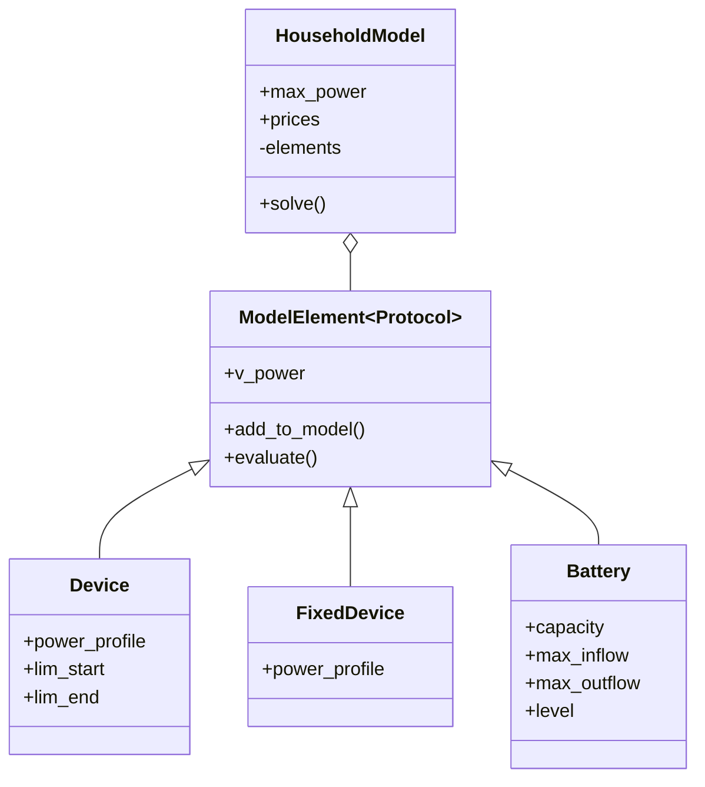

# About

This repository contains source code of various models used for energy cost optimization in regular households. 
It includes dynamic scheduling of appliances and battery charge/discharge profile depending on day-ahead electricity prices, PV generated energy and other constraints.

# Implementation

The models are based on [OR-Tools](https://or-tools.github.io/docs/pdoc/ortools.html) package and its constraint programming (CP) module in particular.

Several classes are defined as depicted below.



## Household

The household is modelled as a collection of elements, where each of them have variable power profile over the time horizon (i.e. energy consumption or production for each timestamp).

The overall power profile of the household is a sum of all elements' profiles for each timestamp.

```python
self.v_power = [
    sum([el.v_power[ts] for el in self.elements])
    for ts in range(self.time_horizon)
]
```

The profile is limited to grid line maximal power.
```python
for tp in self.v_power:
    model.add(tp <= self.max_power)
    model.add(tp >= -self.max_power)
```

The energy costs for individual timestamps are calculated as a product between consumed/produced power at given timestamp and the corresponding price of the electricity.

```python
self.v_costs = [
    self.v_power[ts] * self.prices[ts] 
    for ts in range(self.time_horizon)
]
```

Optimization objective is a sum of all costs for the whole time horizon.

```python
model.minimize(sum(self.v_costs))
```

## Device

Device represents an appliance with specified power profile and variable operational period constrained by start and end timestamps.

```python
self.v_start = model.new_int_var(0, time_horizon)
self.v_end = self.v_start + self.len
model.add(self.v_start >= self.lim_start)
model.add(self.v_end < self.lim_end)
```

A variables for actual power profile over the time horizon are defined for each timestamp.

```python
max_power = max(self.power_profile)
self.v_power = [
    model.new_int_var(0, max_power)
    for ts in range(time_horizon)
]
```

Boolean variables indicating starting timestamp are defined and constrained to single value.

```python
active = [
    model.new_bool_var()
    for ts in range(time_horizon - self.len + 1)
]
model.add_exactly_one(active)
```

The specified device power profile is transferred to the actual power profile via constraint channeling technique. It ensures that the power is assigned for the given timestamp only if device is operational during this period.

```python
for i, act in enumerate(active):
    model.add(self.v_start == i).only_enforce_if(act)
    for k, v in enumerate(self.power_profile):
        model.add(self.v_power[i + k] == v).only_enforce_if(act)
```

## Fixed device

Fixed device is a simplified version of the Device and represents appliances that are operational for the whole time horizon. This can be used to model specific appliances (e.g. fridge) as well as amortized power profile as a whole (e.g. average/typical power consumption).

For convenience fixed device is defined via variables constrained for the specified power profile values.

```python
self.v_power = [
    model.new_int_var(
        self.power_profile[ts],
        self.power_profile[ts]
    )
    for ts in range(time_horizon)
]
```

## Battery

Energy storage system (battery) is implemented similar other elements. It consists of actual power profile for the whole time horizon constrained by maximum power inflow/outflow.

```python
self.v_power = [
    model.new_int_var(self.max_outflow, self.max_inflow)
    for ts in range(time_horizon)
]
```

In addition the battery model tracks its charge level for each timestamp, and enforces causal constraints between current and previous timestamps. 

```python
self.v_level = [
    model.new_int_var(0, self.capacity)
    for ts in range(time_horizon)
]

for ts in range(time_horizon):
    # times 4 due to 15 min intervals
    model.add(
        4 * self.start_level + sum(self.v_power[:ts]) == 4 * self.v_level[ts]
    )
```

# Experiments

A number of experiments were performed on the model featuring various configurations of the elements.

Model inputs, such as energy prices, average daily consumption profile and typical solar irradiation are loaded from data files (provided as examples). Data files are obtained from the following sources:

- Nordpool prices: https://nordpool.didnt.work/
- Typical solar irradiation: https://re.jrc.ec.europa.eu/pvg_tools/en/#MR 


```python
prices = load_prices("2026-01-12 12:00", "2026-01-14")
avg_profile = load_avg_use(prices.index.hour, daily_consumption=10_000)
solar_ghi = load_solar(prices.index, size_m2=16)
```

Various model elements are defined, few examples are listed below.

```python
daily_average = FixedDevice("Daily average", list(avg_profile))
pv_panels = FixedDevice("PV panels", list(-solar_ghi))

devices = [
    Device(
        "Washing",
        [800, 2200, 1000, 1800, 800, 1000],
        lim_start=ts2i(THIS_DAY + 15),
        lim_end=ts2i(THIS_DAY + 23),
    ),
    Device(
        "Cooking",
        [2200] * ts2i(1, 30),
        lim_start=ts2i(THIS_DAY + 17),
        lim_end=ts2i(THIS_DAY + 21),
    ),    
]

battery = Battery(
        "battery",
        capacity=50000,
        max_inflow=3500,
        max_outflow=-5000,
        start_level=20000,
        end_level=30000,
    )
```

A household model is defined and optimized as a combination of the elements.

```python
hm = HouseholdModel(max_power=5200, prices=list(prices / 1000 / 4))
hm.add(daily_average)
hm.add(battery)
hm.add(pv_panels)
hm.solve()
```