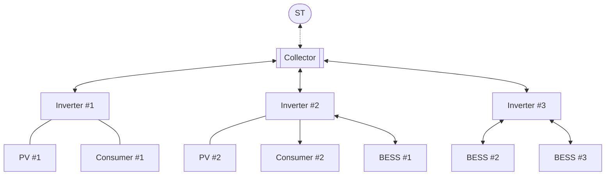

## Example system structure

*Inverters* have internal power limit (connections between devices), as well as output limit (connection to collector);

*Collector* is modelled as inverter with "unlimited" internal power capacity and output is limited by ST connection;

*PVs* output power according to defined profile (in this example based on Global Horizontal Irradiance from typical meteorological year);

*Consumers* consume power according to defined profile (in this example based on average household consumption);

*BESSes* operate under number of constraints, such as energy capacity, max charge/discharge power, cycles limit and efficiency.
  - *BESS #1* has mediocre parameters;
  - *BESS #2* is almost fully charged high performance battery (e.g. Tesla), change level at time horizon is not defined;
  - *BESS #3* is almost empty high capacity battery (e.g. Tesla), expected to be fully charged at time horizon;

The example is meant to demonstrate energy transfer between BESSes with power exceeding inverter's output power, but within its internal limits. Same goes for collector level energy transfer between inverters and ST.